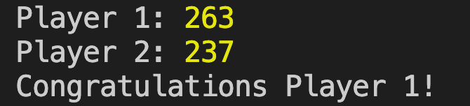

# Poker Hand Sorter in JavaScript

### Instructions

1. Open the 'poker-game' folder in your terminal or preferred code editor.
2. Make sure Node.js is installed on your machine (a quick way to check is by running 'node -v')
3. run: "node index.js" in the command line.

### Expected output

